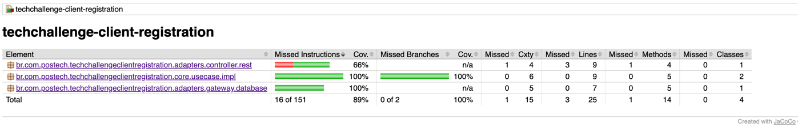
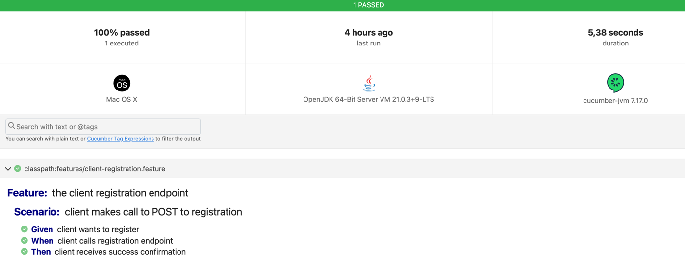

# Clients Api

## Descrição
Api responsável por disponibilizar a criação e busca dos clientes do restaurante.

## Para roda localmente
- Basta executar a aplicação coma IDE de preferência a partir da classe application do java. 
- O Docker compose será executado automaticamente subindo o banco em container via integraçado da dependencia spring-boot-docker-compose.

## Evidências dos Testes:

- Cobertura de Testes:

- BDD com Cucumber:
 

